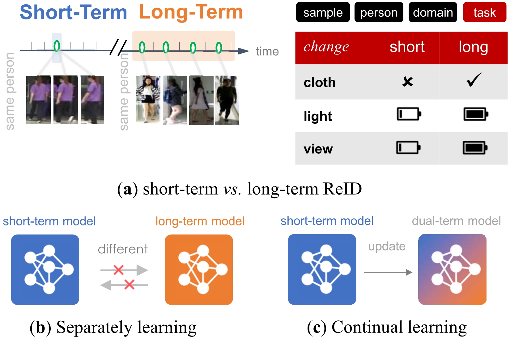

# Continuous Short-Term to Long-Term Person Re-Identification

The *official* repository for [Continuous Short-Term to Long-Term Person Re-Identification], IJCAI 2023 (Under Review).

Thank you for your kindly attention.

The code will be available soon.

<**Illustration of task variation and model's continus learning**>

- (a) ***ST-ReID vs. LT-ReID*** The task variation present in the S2L-ReID is greater due to the shot interval of the different samples of person than the domain variation present in the different ST-ReIDs.
- (b) ***Separately learning*** A model trained only on one side can not adapt to the other side.
- (c) ***Continual learning*** We propose continuous person re-identificationfrom short-term to long-term, which updates to a dual-term model.
