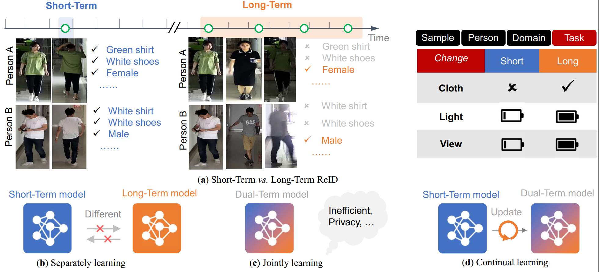
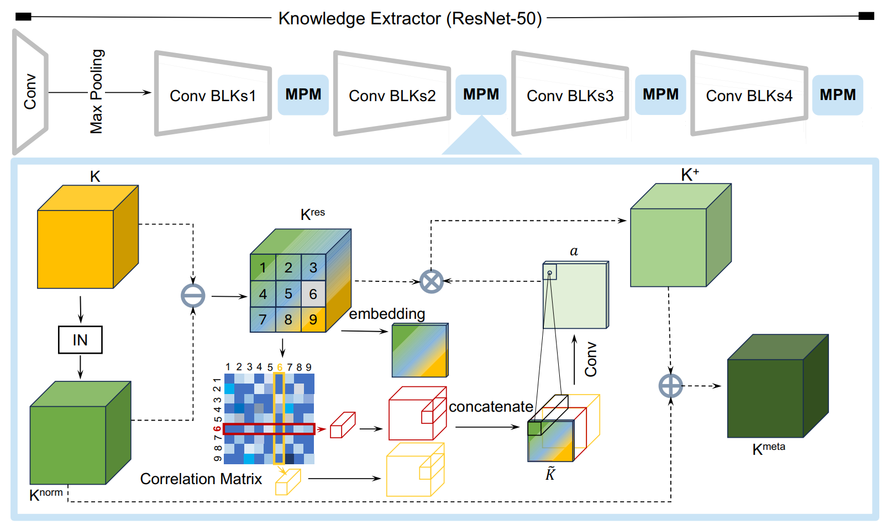
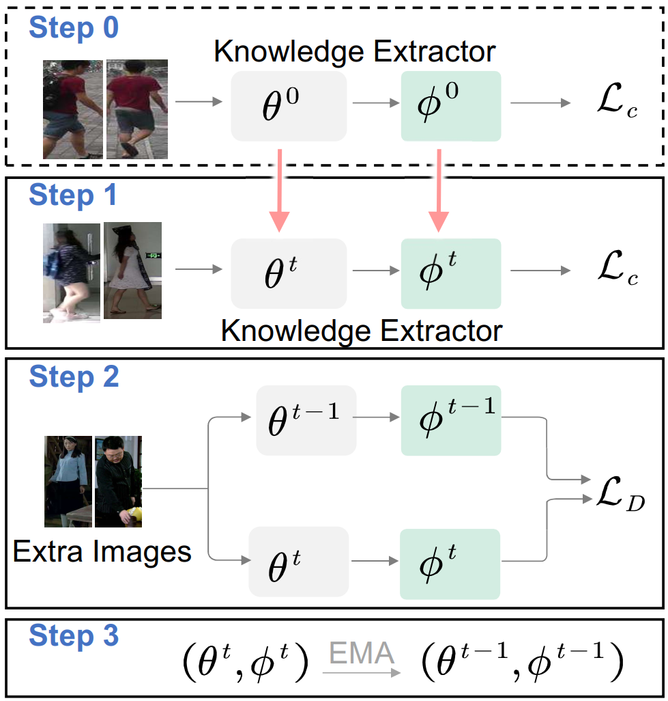

# Bridging the Short-Term and Long-Term Gap: A Cross-Task Continuous Learning Person Re-Identification Problem

The *official* repository for [Bridging the Short-Term and Long-Term Gap: A Cross-Task Continuous Learning Person Re-Identification Problem], TMM 2026 (ACCEPT).

Thank you for your kindly attention.

The code will be available soon.

<**Illustration of task variation and model's continus learning**>

- (a) ***ST-ReID vs. LT-ReID.*** The task variation present in the S2L-ReID is greater due to the shot interval of the different samples of person than the domain variation present in the different ST-ReIDs.
- (b) ***Separately learning.*** A model trained only on one side can not adapt to the other side.
- (c) ***Continual learning.*** We propose continuous person re-identificationfrom short-term to long-term, which updates to a dual-term model.

## Abstract
Person Re-IDentification (ReID) plays an important role in the application of intelligent security systems. Significant advancements have been made in Short-Term (ST) ReID tasks, where person appearances remain relatively constant. Similarly, progress has been achieved in Long-Term (LT) ReID tasks, which are characterized by drastic changes in person appearances. However, a vital yet overlooked challenge in real-world ReID is maintaining the continuity of the retrieval process. When transitioning from ST to LT ReID, simply discarding the ST model in favor of the LT model can lead to a severe performance drop during the early retrieval stage, due to the loss of valuable appearance-related knowledge in the ST model. Conversely, discarding the LT model and relying solely on the ST model may significantly reduce accuracy during the extended retrieval stage, as it overly depends on appearance-related knowledge. Therefore, we delve into a novel ReID problem with practical ramifications, namely short-term to long-term ReID (S2L-ReID), which continuously learns from ST to LT task. Existing continuous learning methods, only designed to mitigate domain differences across ST domains, face substantial challenges when dealing with the significant task gap in the S2L problem. These challenges manifest as severer catastrophic forgetting due to knowledge conflicts between ST and LT tasks and mutual constraints during optimization between over-coupling new knowledge adaptation and old knowledge non-forgetting tasks. To address these challenges, we propose a unified Meta-Knowledge Accumulation framework (MKA), which enables continuous learning of universal meta-knowledge for all tasks. It comprises a plug-and-play Meta-knowledge Purify Module (MPM) to alleviate knowledge conflicts by filtering out task-specific knowledge. Additionally, a transferable Peer Learning Strategy (PLS) is included to weaken mutual constraints by alternating between old and new models and enabling mutual learning. Finally, considering that real continuous application processes need to process the retrieval from ST to LT data, we propose a new Joint-Tests evaluation for evaluating the performance of the model on the more realistic hybrid data. Notably, MKA requires only a small computational resource usage with good portability. Empirical evaluations on all test settings exhibit that our MKA attains the best performance and is highly portable.

## S2L-ReID Task
Real-world Re-ID scenarios are constantly changing yet complex and diverse. In order to cope with new data and new challenges, the Re-ID system should be able to learn continuously. For example, a Re-ID model that has been trained on the past popular short-term datasets is likely to be cloth-invariant, which is not suitable for the recently proposed long-term datasets. Simply mixing all the old and new data to retrain a model from scratch would be extremely time-consuming. Hence, how to make a model smoothly adapt to new data with large task variations while maintaining learned meta-knowledge is a realistic and valuable problem.

## Methodology

<**Illustration of Meta-Knowledge Accumulation framework (MKA)**>

S2L-ReID is essentially a lifelong Re-ID task, but it suffers from a more severe catastrophic forgetting than usual lifelong learning tasks due to the existence of knowledge conflicts caused by task variations. As mentioned above, large task variations not only reduce the short-term model's adaptation ability to long-term samples but also lay the hidden danger for its subsequent continuous training stage. In addition, the Re-ID system has a limited memory bank, so it is bound to clear some old knowledge to allocate space for new knowledge. For the system to make a smooth transition from short-term to long-term scenarios, we need to address two challenges: i) How to eliminate task-specific knowledge to alleviate knowledge conflicts; ii) How to balance the learning of new knowledge and retaining of old knowledge.

To address these two challenges, we propose our MKA framework to learn the identification knowledge common to all tasks, as shown in Figure. The framework has two important components, namely the style eliminating module and the peer learning strategy.
