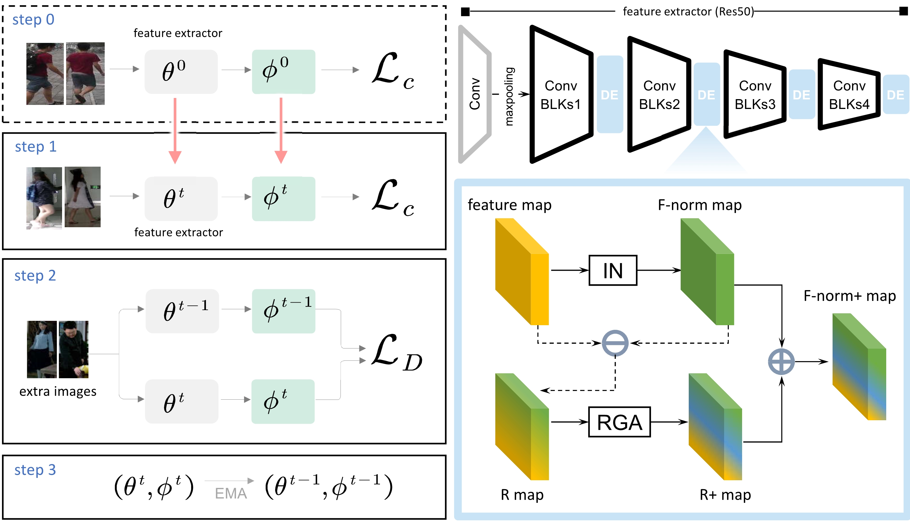

# Continuous Short-Term to Long-Term Person Re-Identification

The *official* repository for [Continuous Short-Term to Long-Term Person Re-Identification], TMM 2026 (ACCEPT).

Thank you for your kindly attention.

The code will be available soon.

<**Illustration of task variation and model's continus learning**>

- (a) ***ST-ReID vs. LT-ReID.*** The task variation present in the S2L-ReID is greater due to the shot interval of the different samples of person than the domain variation present in the different ST-ReIDs.
- (b) ***Separately learning.*** A model trained only on one side can not adapt to the other side.
- (c) ***Continual learning.*** We propose continuous person re-identificationfrom short-term to long-term, which updates to a dual-term model.

## Abstract
The realm of person re-identification (Re-ID) has attained peak performance on short-term tasks, however, it is plagued by the issue of catastrophic forgetting when applied to long-term samples in reality. In this study, we delve into a novel Re-ID task with practical ramifications, namely continuous short-term to long-term person re-identification (S2L-ReID), which addresses catastrophic forgetting through continuous learning from short-term to long-term. While existing methods have dealt with catastrophic forgetting between different short-term tasks through lifelong learning, they still encounter difficulties in the S2L-ReID task such as the exacerbation of catastrophic forgetting caused by conflicts in knowledge between short-term and long-term tasks and over-coupling in knowledge distillation methods adopted by existing works, leading to mutual constraints during the optimization process. To address these challenges, we propose a Meta-Knowledge Accumulation framework (MKA) for learning common knowledge to all tasks, comprising of a plug-and-play style elimination module to alleviate knowledge conflicts through the filtering of task-specific knowledge and a transferable peer learning strategy to weaken over-coupling by alternating between old and new models and mutually learning from each other. Empirical evaluations exhibit that our proposed approach attains the best performance.

## S2L-ReID Task
Real-world Re-ID scenarios are constantly changing yet complex and diverse. In order to cope with new data and new challenges, the Re-ID system should be able to learn continuously. For example, a Re-ID model that has been trained on the past popular short-term datasets is likely to be cloth-invariant, which is not suitable for the recently proposed long-term datasets. Simply mixing all the old and new data to retrain a model from scratch would be extremely time-consuming. Hence, how to make a model smoothly adapt to new data with large task variations while maintaining learned meta-knowledge is a realistic and valuable problem.

## Methodology

<**Illustration of Meta-Knowledge Accumulation framework (MKA)**>

S2L-ReID is essentially a lifelong Re-ID task, but it suffers from a more severe catastrophic forgetting than usual lifelong learning tasks due to the existence of knowledge conflicts caused by task variations. As mentioned above, large task variations not only reduce the short-term model's adaptation ability to long-term samples but also lay the hidden danger for its subsequent continuous training stage. In addition, the Re-ID system has a limited memory bank, so it is bound to clear some old knowledge to allocate space for new knowledge. For the system to make a smooth transition from short-term to long-term scenarios, we need to address two challenges: i) How to eliminate task-specific knowledge to alleviate knowledge conflicts; ii) How to balance the learning of new knowledge and retaining of old knowledge.

To address these two challenges, we propose our MKA framework to learn the identification knowledge common to all tasks, as shown in Figure. The framework has two important components, namely the style eliminating module and the peer learning strategy.
